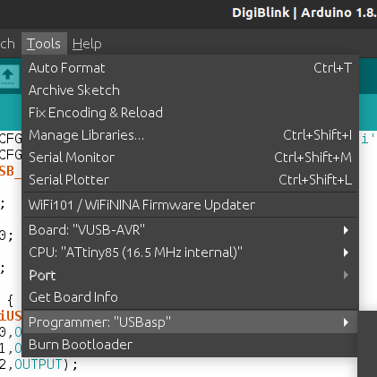
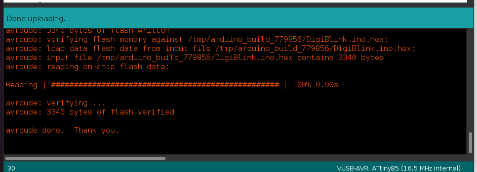
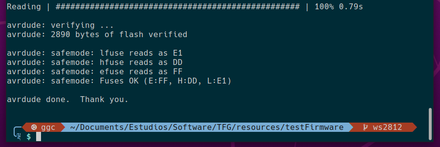

# How-To Flash a Custom Firmware

The *Digispark ATTiny85* comes by default with a bootloader called *Micronucleus* that can talk to the host computer via serial communication, giving the user the option to upload new code through the USB port and avoiding the use of a *USBASP-like* programmer.

That feature may be useful sometimes, but there are certain cases where we may need to flash a custom bootloader, *C/C++* firmware or any sort of program that need to completely erase the ROM, and this can't be done using Micronucleus.

So in this quick guide, we're going to solve that.

## Hardware

* **ICSP Programmer**: we'll use that to talk to the chip's ROM. *USBASP* is the one I'm going to be using, but any programmer with *MISO/MOSI/SCK/RST* pins will work, even an *Arduino* flashed with the *ArduinoISP* sketch.
* **Digispark ATTiny85**


## Software

* **Arduino IDE**: we'll use the *AVR* tools that come with it.


## Wiring

| ISCP Programmer | Digispark ATTiny85 |
| :-------------: | :----------------: |
|      MOSI       |        PB0         |
|      MISO       |        PB1         |
|       SCK       |        PB2         |
|      RESET      |        PB5         |
|       5V        |         5V         |
|       GND       |        GND         |


## Flashing an Arduino Sketch

The first thing to do is click on the *Tools* tab and select the correct *Board* and CPU. *Then*, we select the *Programmer* we're using.




Once all the parameters are set, we just need to hit the flash button and cross our fingers. If the flashing process has finished successfully, we'll get a message like the following:




## Flashing a custom hex file

Flashing an existent hex file may be useful if we want to install a pre-compiled *firmware/bootloader* or upload a *C/C++* program.

*Arduino* comes with some *AVR* utilities we can use from our terminal to compile and flash code to *AVR microcontrollers*.

First thing is to locate our *Arduino IDE* directory, below is one way to do it:

```bash
$ ls -l `which arduino`
lrwxrwxrwx root root 73 B Tue Jul 12 16:44:01 2022 /usr/local/bin/arduino ⇒ /home/ggc/arduino-1.8.19/arduino
```

Once we know where it's located, let's check for the following utilities and files:

* ```arduino-1.8.19/hardware/tools/avr/bin/avrdude```
* ```arduino-1.8.19/hardware/tools/avr/etc/avrdude.conf```

Now all that is left to do is flash the hex file using the command line using the following arguments:

* **-C**, default Arduino IDE configuration file
* **-v**, verbose output
* **-p**, microcontroller
* **-c**, programmer
* **-P**, port
* **-U**, instruction. Syntax: *memtype*:*op*:*filename*[:*format*]

```bash	
arduino-1.8.19/hardware/tools/avr/bin/avrdude -Carduino-1.8.19/hardware/tools/avr/etc/avrdude.conf -v -pattiny85 -cusbasp -Pusb -Uflash:w:main.hex:i 
```

More ```avrdude``` arguments and in-depth explanations can be found here: https://www.nongnu.org/avrdude/user-manual/avrdude_3.html

If the flashing process has finished successfully, we'll get a message like the following:

