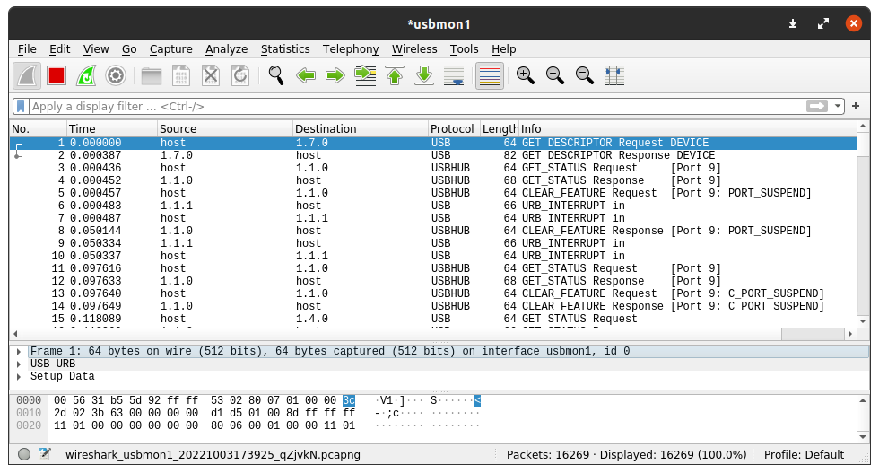
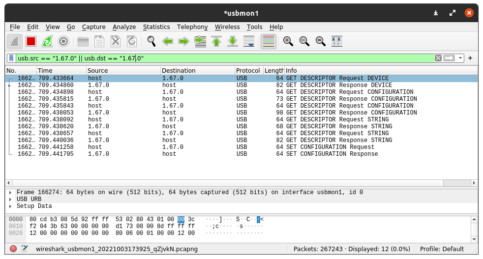

# How-To Monitor USB Traffic via Wireshark

This is a quick guide on how to capture and display USB traffic with Wireshark GUI interface which makes it very easy to interact with.

All the software and testing has been done under `Ubuntu 20.04.5 LTS` with the kernel`5.15.0-48-generic`.

## Software

All the packages needed to monitor the traffic can be installed from the Ubuntu repositories using `apt`.

``` bash
sudo apt install wireshark libpcap0.8
```

Also, the `usbmon` module has to be enabled in order to access the usb traffic.

```bash	
sudo modprobe usbmon
```

## Opening Wireshark

As we're going to be accessing physical hardware, we need to open Wireshark as a superuser. To accomplish that, we can launch it from the terminal as follows:

```bash
sudo wireshark
```

## Selecting the right usbmonX interface

Once we have opened Wireshark, we'll see a few *usbmon* interfaces we can monitor from. To select the correct one, we need to check which bus is our usb device connected to. We can use `lsusb` for that task.

```bash
$ lsusb
Bus 001 Device 067: ID 16c0:05df Van Ooijen Technische Informatica HID device
```

In this case, we'll choose *usbmon1* since our device is connected to the bus 001 as we see on the *lsusb* output. Also, we can see that the *DeviceID* is the number 67, this will be useful later for the display filter.

## Starting the capture

To start capturing traffic, we just need to double click on the correct *usbmon* interface and it'll automatically start showing some traffic. Most of the traffic displayed won't be useful for us, so the best thing to do now is apply some filters to only show the traffic regarding our usb device.



## Filtering the traffic

As I've said before, the best way to display useful traffic is using display filters, so let's do it. 

The syntax is very simple, so we can write it our selfs or right click a package from our device and prepare it as a filter, but basically all we need to introduce is:

```
usb.src == "1.67.0" || usb.dst == "1.67.0"
```

Where the first number corresponds to the bus, the second to the device id and the third to the endpoint id.

