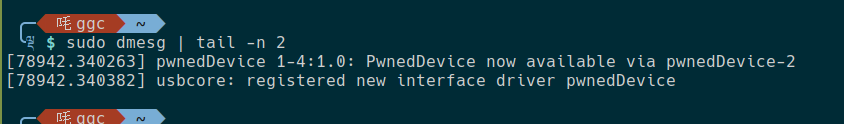
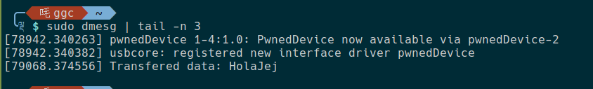

# BasicInterrupt - Driver asíncrono con comunicación INTERRUPT IN

## Descripción del funcionamiento 

Este módulo del kernel implementa un driver USB utilizando el endpoint de tipo IN del dispositivo USB, así como la API asíncrona del kernel.

El funcionamiento del módulo es muy sencillo, una vez cargado en el kernel, expone un dispositivo de caracteres que tiene implementada la operación de lectura. Por ello, si lanzamos una llamada `read()`, por ejemplo con `cat`, iniciaremos la rutina que envía el URB de tipo *INTERRUPT IN* al dispositivo pidiéndole que le rellene el buffer enviado con datos.

Como se usa la API asíncrona de USB la llamada a `read()` devuelve siempre 0 bytes, ya que no se sabe con exactitud cuándo se va a devolver el URB relleno con datos y al ser una función no bloqueante no esperamos a que llegue. El resultado de esta solicitud de datos al dispositivo se mostrará a través de la función de callback que se invoca una vez el URB vuelve desde el dispositivo.

## Uso

Para usar este driver tan solo hay que compilarlo y cargarlo en el kernel.

```bash
make
sudo insmod BasicInterrupt.ko
```

Una vez cargado en el kernel, podemos ver en kern.log que ya está disponible y si tenemos conectado el dispositivo USB también será reconocido.



Y si ejecutamos una llamada a `read()`, por ejemplo usando el comando `cat`, veremos la información que devuelve el dispositivo.




